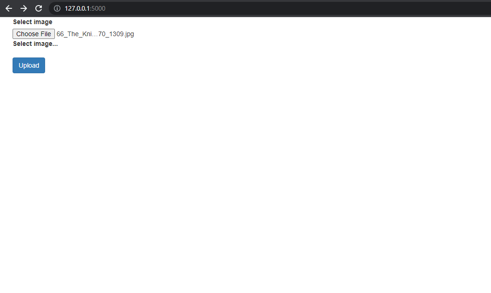
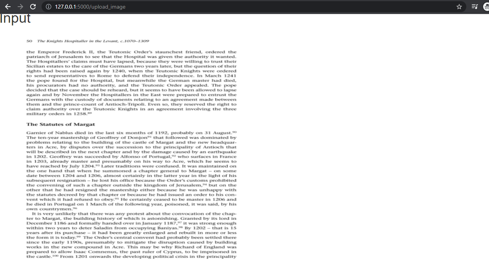
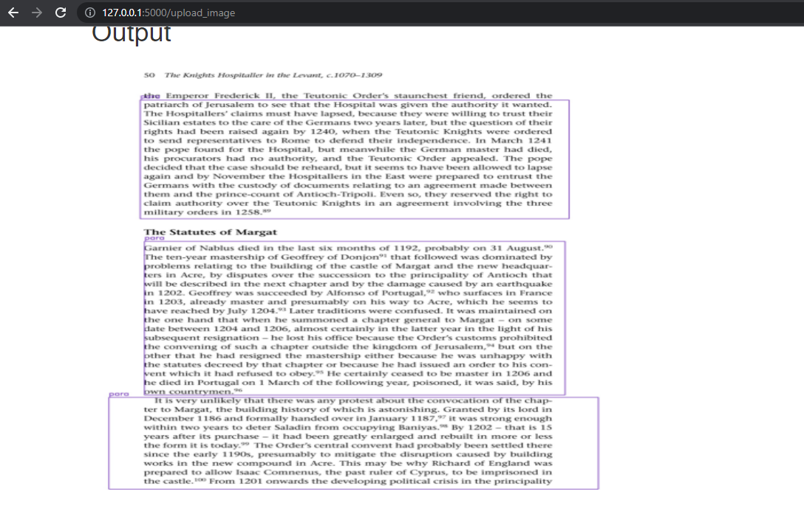
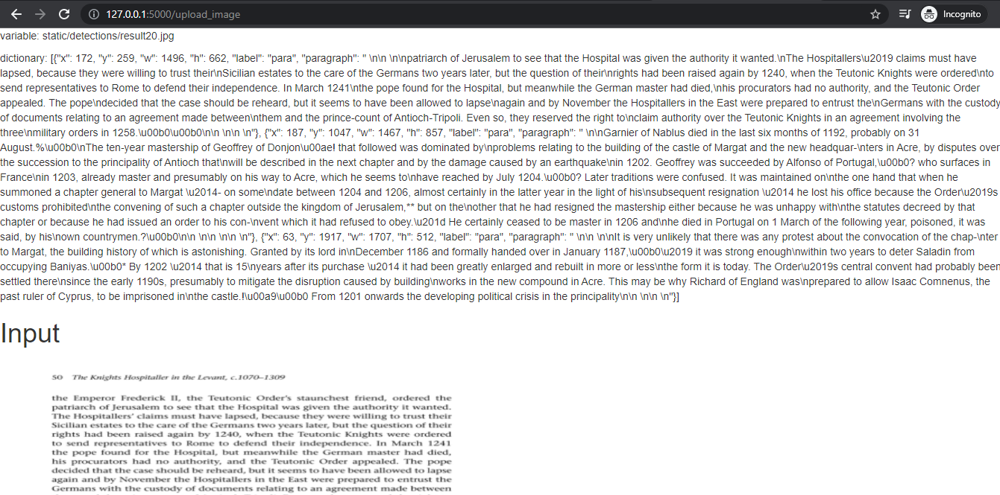

# Paragraph Detection and Recognization

This project about text Detection and recognization from a document.This project based on end-to-end web Application where user can select the image of document and then model will produce resultant
image with bounding boxes on paragrphs and recognize those particular cropped paragraphs.

# Some Screenshots:

**Detection:**

**Recognization in the form of Api:**

